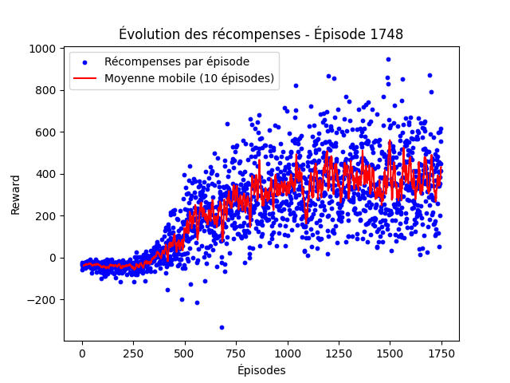

# IA Snake - Reinforcement Learning

## Description
Ce projet implémente une intelligence artificielle capable d'apprendre à jouer au jeu Snake grâce à l'apprentissage par renforcement. L'algorithme utilise un réseau de neurones entraîné avec Deep Q-Learning pour optimiser ses décisions en fonction de l'environnement du jeu.

## Installation
### Prérequis
Assurez-vous d'avoir Python installé sur votre machine.

### Cloner le projet
```bash
git clone https://github.com/SachaHenneveux/snakeIA.git
cd snakeIA
```

### Créer un environnement virtuel
```bash
python -m venv venv
source venv/bin/activate  # Sur Windows : venv\Scripts\activate
```

### Installer les dépendances
```bash
pip install -r requirements.txt
```

## Utilisation
### Entraîner l'IA
```bash
python train_test.py --train
```

### Tester l'IA entraînée
```bash
python train_test.py --test
```

## Structure du projet
```
|-- agent.py          # Contient l'agent DQN
|-- environnement.py  # Définit l'environnement du jeu Snake
|-- graphics.py       # Gère l'affichage avec pygame
|-- train_test.py     # Fichier principal pour l'entraînement et les tests
|-- requirements.txt  # Liste des dépendances nécessaires
```

## Résultats
L'IA apprend progressivement à optimiser ses déplacements pour maximiser son score. Voici un exemple de progression :



## Auteurs
- **Sacha Henneveux**

## Licence
Ce projet est sous licence MIT.

